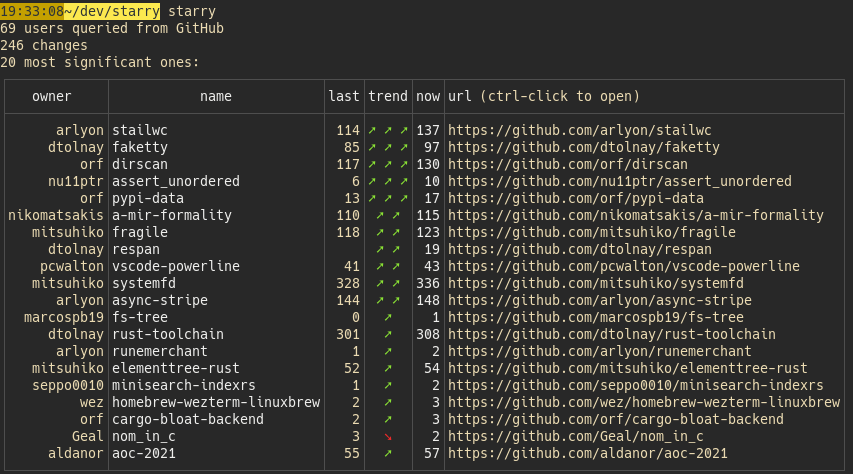
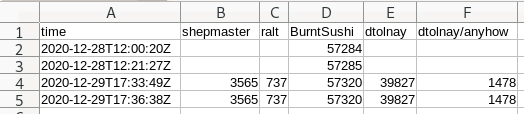

[s1]: https://img.shields.io/crates/v/starry.svg
[l1]: https://crates.io/crates/starry

[s2]: https://miaou.dystroy.org/static/shields/room.svg
[l2]: https://miaou.dystroy.org/3768?rust

# starry

A tool to store the counts of GitHub stars.

## Why

Did you notice all those tools pretending to graph the numbers of stars on repositories are always only rising ?

That's because you've been lied to: those tools only show the current stars, with their age. Because that's the only information you can get with the GitHub API.

If you want to see the real stars graph there's no other solution than to regularly query and store the numbers. That's what this tool does.

Because the history of current stars tells only half the starry.

## Installation

	cargo install starry

## Usage

In order to query the GitHub API, you must register your API token:

	starry set github_api_token your-token

(see https://docs.github.com/en/free-pro-team@latest/github/authenticating-to-github/creating-a-personal-access-token for creation)

You need to say what user(s) you want to follow:

	starry follow dtolnay
	starry follow ralt

Fetching the stars is done with

	starry

Starry will tell you about new repositories and rising or dropping stars:

If you want regular data, you should probably add a cron rule.

Data are stored in clear in CSV files (if you're on linux, they're in `~/.local/share/starry/stars`.
Those files can be used as is.

If you want time series, for example to graph them, you may extract them as csv with the `extract` subcommand:

	starry extract shepmaster ralt BurntSushi dtolnay dtolnay/anyhow > test.csv

In this query we want to get the time series of 4 users (meaning their total number of stars) and one repository.

Here's an example of result:

## What's next

After I've accumulated more data, I might add a few features (you may ask for them if you want), like

* proper trending analysis
* a svg graph generator
* a miaou plugin
* a web page for people to register their name and start gather history too
* an alert when I'm in a boring meeting that dtolnay made a new thing
* etc.
